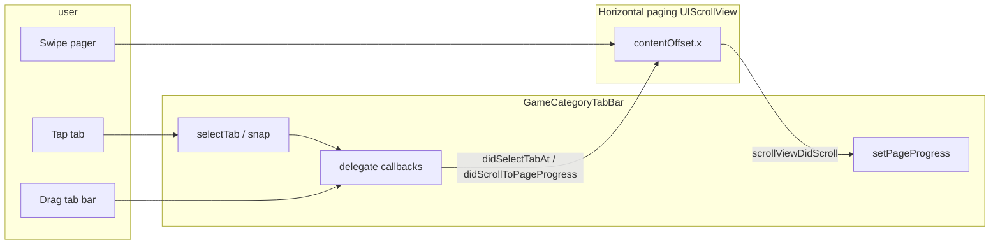

# Game Category Tab Bar — How-To

`GameCategoryTabBar` is a horizontally scrollable category strip with a **fixed center pill** and labels that slide underneath. It is designed to stay in sync with a **paged horizontal scroll view** (continuous progress while swiping, snap on release).

Reference implementation: `hardway-craps/MainViewController.swift`.

---

## Key file

| File | Purpose |
|------|---------|
| `hardway-craps/Games/GameCategoryTabBar.swift` | Tab bar UI, scroll math, delegate callbacks |

---

## What you get

- One tab per title string; cell width is derived from label text (+ padding).
- A gray pill (`HardwayColors.surfaceGray`) stays centered; width **morphs** between adjacent tabs as you scroll.
- Label color blends from `HardwayColors.label` → white based on how centered each tab is.
- Light haptic on tap or programmatic `selectTab`.
- Fixed height **44 pt**; `translatesAutoresizingMaskIntoConstraints = false` (use Auto Layout on the host).

Programmatic init only — `init(coder:)` is unavailable.

---

## Public API

### Creation

```swift
private lazy var tabBar = GameCategoryTabBar(titles: ["Craps", "Crapless", "Blackjack", "Baccarat"])
```

Tab count is fixed at init time. If categories change at runtime, create a new bar or extend the component (not supported today).

### Delegate (`GameCategoryTabBarDelegate`)

| Callback | When | Typical host action |
|----------|------|---------------------|
| `tabBar(_:didSelectTabAt:)` | User taps a tab, or tab bar finishes a snap after drag | Scroll pager to page `index` (animated) |
| `tabBar(_:didScrollToPageProgress:)` | User drags the tab bar (not programmatic moves) | Set pager `contentOffset.x = progress * pageWidth` |
| `tabBarDidEndScrolling(_:)` | Tab bar finishes a programmatic scroll animation | Clear “sync guard” flag on host |

### Driving the tab bar from the pager

```swift
// progress is 0 ... (tabCount - 1), fractional while mid-swipe
tabBar.setPageProgress(progress, animated: false)
```

### Driving the tab bar from code (no pager gesture)

```swift
tabBar.selectTab(at: 2, animated: true)
```

Read-only: `tabBar.selectedIndex`.

---

## How to use the component

### 1. Add the tab bar to your hierarchy

Pin it under the safe area (or navigation). Assign the delegate before interaction.

```swift
tabBar.delegate = self
view.addSubview(tabBar)

NSLayoutConstraint.activate([
  tabBar.topAnchor.constraint(equalTo: view.safeAreaLayoutGuide.topAnchor),
  tabBar.leadingAnchor.constraint(equalTo: view.leadingAnchor),
  tabBar.trailingAnchor.constraint(equalTo: view.trailingAnchor),
])
```

Optional: place a blur view behind it (see `setupTabBarWithBlur()` in `MainViewController`).

### 2. Pair it with a horizontal paging scroll view

Use one page per category. Page width = scroll view bounds width; `contentSize.width = pageWidth * tabCount`.

`MainViewController` uses `HorizontalPagingScrollView` so vertical table scrolling inside pages is not stolen by horizontal swipes. Any `UIScrollView` with paging behavior works if gesture conflicts are handled.

Layout tip: pager can share the same top anchor as the tab bar; give table views **top content inset** so rows are not hidden under the tab bar (see `updateTableViewInsets()` in `MainViewController`).

### 3. Implement `GameCategoryTabBarDelegate` (tab bar → pager)

When the user picks a tab, scroll the pager. When they drag the tab bar, move the pager continuously.

```swift
extension MyViewController: GameCategoryTabBarDelegate {
  func tabBar(_ tabBar: GameCategoryTabBar, didSelectTabAt index: Int) {
    let offsetX = pagingScrollView.bounds.width * CGFloat(index)
    isUpdatingFromScroll = true
    pagingScrollView.setContentOffset(CGPoint(x: offsetX, y: 0), animated: true)
  }

  func tabBar(_ tabBar: GameCategoryTabBar, didScrollToPageProgress progress: CGFloat) {
    let width = pagingScrollView.bounds.width
    guard width > 0 else { return }
    isUpdatingFromScroll = true
    pagingScrollView.contentOffset.x = progress * width
  }

  func tabBarDidEndScrolling(_ tabBar: GameCategoryTabBar) {
    isUpdatingFromScroll = false
  }
}
```

### 4. Sync pager → tab bar in `scrollViewDidScroll`

When the **pager** moves, update the tab bar. Use a guard flag so pager updates triggered by the tab bar do not loop.

```swift
private var isUpdatingFromScroll = false

func scrollViewDidScroll(_ scrollView: UIScrollView) {
  guard scrollView === pagingScrollView else { return }
  let width = scrollView.bounds.width
  guard width > 0 else { return }
  let progress = scrollView.contentOffset.x / width
  if !isUpdatingFromScroll {
    tabBar.setPageProgress(progress, animated: false)
  }
}

func scrollViewDidEndScrollingAnimation(_ scrollView: UIScrollView) {
  if scrollView === pagingScrollView { isUpdatingFromScroll = false }
}

func scrollViewDidEndDecelerating(_ scrollView: UIScrollView) {
  if scrollView === pagingScrollView { isUpdatingFromScroll = false }
}
```

Set `isUpdatingFromScroll = true` before any pager change initiated by the tab bar; clear it when scrolling ends (`tabBarDidEndScrolling`, pager deceleration, or `scrollViewDidEndScrollingAnimation`).

### 5. Mental model: `pageProgress`

```
pageProgress = contentOffset.x / pageWidth   // 0.0 ... (count - 1)
```

- **Integer** progress → a tab is centered.
- **Fractional** progress → between two tabs (pill width and label colors interpolate).

The tab bar keeps an internal `pageProgressTracking` so layout passes restore fractional position instead of snapping to `selectedIndex`.

---

## Data flow (bidirectional sync)



---

## Behaviors worth knowing

1. **Tap vs drag** — Tap calls `didSelectTabAt` immediately and animates the tab bar; drag streams `didScrollToPageProgress` until snap, then `didSelectTabAt` at the nearest index.
2. **Programmatic scroll flag** — `setPageProgress` and `selectTab` set internal flags so the delegate is not spammed with progress while the host is already driving the pager.
3. **`suspendSelectionSyncFromScroll`** — During animated `scrollToItem`, intermediate scroll positions do not flip `selectedIndex` (avoids tab flash).
4. **Insets** — Section insets center the first and last tab at `contentOffset.x == 0` and max offset; rubber-banding is at the ends.
5. **Styling** — Pill and typography are defined inside `GameCategoryTabBar.swift` (`TabCell`, 14 pt semibold). Reuse as-is for visual consistency with the games hub.

---

## Minimal checklist for a new screen

- [ ] `GameCategoryTabBar(titles:)` with one title per page
- [ ] Constrain tab bar (top / leading / trailing)
- [ ] Horizontal paging scroll view with N equal-width pages
- [ ] `tabBar.delegate = self`
- [ ] `GameCategoryTabBarDelegate` → update pager offset
- [ ] `UIScrollViewDelegate` on pager → `setPageProgress` when `!isUpdatingFromScroll`
- [ ] Clear `isUpdatingFromScroll` when either side finishes scrolling
- [ ] Content inset on page content so it clears the 44 pt tab bar

---

## When not to use this component

- Single category (no paging) — a plain segmented control or static header is simpler.
- Dynamic tab labels or counts after load — titles are fixed at `init`.
- Vertical category lists — this is horizontal-only.

For a full working example, read `MainViewController` (`setupTabBarWithBlur`, `setupPagingScrollView`, and the `GameCategoryTabBarDelegate` / `UIScrollViewDelegate` extensions).
